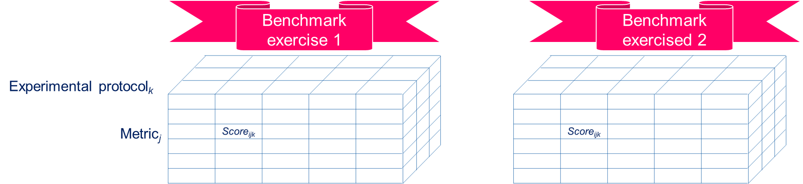

# Benchmark 1. "TemplateName"

This is a template that details the expected Minimum Viable Content of a benchmark. All minimum constitutive elements of a benchmark are formally defined in the meta-model below so as to share reproducible results.

## Introduction

*Guidelines:*

Write a short introduction of the benchmark that includes at least the following items:

- Type of research: does the benchmark intends to be qualitative and/or quantitative?
- The main discipline(s) it contributes to
- The goal of the study (to understand and/or improve design)
- The type of contribution (theory to knowledge and/or empirical to practice)
- Object(s) to validate (theory, method, tool, process...)
- Expected results

*Template:*

## Glossary

*Guidelines:*

To share a common understanding of ambiguous keywords, contributors shall agree upon the meaning of the keywords by systematically providing a definition and synonyms. Contributors should reuse existing terms and definitions from existing standards and not invent new ones, unless they have a very specific concept that requires the introduction of a new keyword and definition. Any new keyword and definition must be motivated and explained in the discussion of the repository (e.g. navigate to '*Repositories > Benchmark-0_Template > Discussions*', or [click here](https://github.com/GIS-S-mart/Benchmark-0_Template/discussions))

*Template:*

| **Keyword** | **Synonyms** | **Definition** | **Source** |
| :---------: | :----------: | :------------: | :--------: |
|             |              |                |            |

## Goals

Specify the common set of goals that the competing solutions pursue:
- The solution shall enable to...
- The solution shall enable to...
- The solution shall enable to...

## Metrics

Metrics are quantitative and/or qualitative performance indicator that measures the degree to which the articulated goals have been achieved.

*Guidelines:*

1. The achievement of a given goal may be measured by one or more metrics.
2. Results must be quantitatively and not only qualitatively compared to the literature in a fair and transparent manner.
3. Authors should use existing metrics and not invent new ones, unless they measure additional aspects not covered by existing ones.
4. Any change to existing metrics must be motivated and explained in the discussion of the repository (e.g. navigate to '*Repositories > Benchmark-0_Template > Discussions*', or [click here](https://github.com/GIS-S-mart/Benchmark-0_Template/discussions). Once the suggested change is informally approved by the community, the author shall post on the issues page of the benchmark (e.g. navigate to '*Repositories > Benchmark-0_Template > Issues*', or [click here](https://github.com/GIS-S-mart/Benchmark-0_Template/issues)) and briefly outline the new metric.

*Template:*

| **Name** | **Definition** | **Unit** |
| :------: | :------------: | :------: |
|          |                |          |

## Benchmark exercises

Benchmark exercises are test cases that serve to evaluate rival solutions.

*Guidelines:*

1. A benchmark exercise is a representative example problem of the actual problem for which the solutions are intended.
2. Authors should reuse existing benchmark exercises and not invent new ones, unless they have a very specific illustrative purpose not covered by existing ones.
3. The lack of showing particular benchmark exercises in a manuscript says more than the benchmark exercises included in a manuscript.
4. Any change to existing benchmark exercises must be motivated and explained in the discussion of the repository (e.g. navigate to '*Repositories > Benchmark-0_Template > Discussions*', or [click here](https://github.com/GIS-S-mart/Benchmark-0_Template/discussions). Once the suggested change is informally approved by the community, the author shall post on the issues page of the benchmark (e.g. navigate to *Repositories > Benchmark-0_Template > Issues*, or [click here](https://github.com/GIS-S-mart/Benchmark-0_Template/issues)) and briefly outline the new benchmark exercises.
5. A benchmark exercise shall be stored on an open online repository (to be selected according to the type and size of the dataset, licensing, etc.) such as [Zenodo](https://zenodo.org/), [Recherche Data Gouv](https://entrepot.recherche.data.gouv.fr/dataverse/root), [Harvard Dataverse](https://dataverse.harvard.edu/), [4TU.ResearchData](https://data.4tu.nl/info/en/), [B2SHARE](https://eudat.eu/catalogue/B2SHARE), [B2DROP](https://eudat.eu/catalogue/B2DROP) with a preference for repositories such as [Zenodo](https://zenodo.org/) which creates a persistent identifier (DOI) for the repository. This helps for [referencing and citing a  GitHub repository](https://docs.github.com/fr/repositories/archiving-a-github-repository/referencing-and-citing-content).
6. If the benchmark exercise is not stored in the benchmark GitHub repository, contributors should specify the hyperlink to the source.
7. An existing benchmark exercise may be modified according to the feedback of members of the benchmark community. It is important to specify the version of the benchmark exercise in order to evaluate candidate solutions on the latest version.

*Template:*

| **Name** | **Author(s)** | **Version** | **DOI** | **URL** | **License** |
| :------: | :-----------: | :---------: | :-----: | :-----: | :---------: |
|          |               |             |         |         |             |

## Solutions

A solution is a candidate theory, process, method, practice, [...], or software that aims to solve a benchmark exercise.

*Guidelines:*

1. It is imperative for good scientific practice that all results are reproducible.
2. It is strongly recommended to publish the research material (e.g., software code - at least an executable file -, model, simulation, coding book, interviews,  statistics, raw data, observation voice/video recordings, etc.).
3. The quantitative and/or qualitative metric serve as a a level of evidence which can be of four types:
   1. **Measured**: the benefit is measured through a measurement protocol.
   2. **Observed**: the benefit is noticed by the researcher(s) but is not measured through a measurement protocol.
   3. **Perceived**: the benefit - claimed without evidence - is expected or perceived to be evident by the researcher(s) but the claim is not based on a measurement protocol.
   4. **Reference** to another source: the benefit is cited from another source.

*Template:*

| **Name** | **Author(s)** | **Version** | **DOI** | **URL** | **License** | Evidence |
| :------: | :-----------: | :---------: | :-----: | :-----: | :---------: | -------- |
|          |               |             |         |         |             |          |

## Measurement protocols

A measurement protocol is a logical and repeatable procedure to evaluate the metrics when one use a candidate solution to solve a benchmark exercise. It ensures the successful replication of results by others. The recipe highly depends on the preferred research approach (quantitative empirical studies, qualitative empirical studies, mixed-methods studies, analytical studies, experiments, quasi-experiments, ethnographic research, phenomenological research, grounded theory, hermeneutics, case study research, action research, etc.). A measurement protocol may be solution agnostic or part of a candidate solution.

*Guidelines:*

1. 
2. 

*Template:*

## Benchmarking

Benchmarking shall enable visitors to determine which solution is better to employ in a specific context.

*Guidelines:*

1. When presenting a new solution, results must be quantitatively and not only qualitatively compared to the literature.
2. The comparison of solutions must be done in a fair and transparent manner.
3. Results should also be critically judged for physical sanity to avoid the ones that make little sense.

*Template:*

## Meta-Analysis

A meta-analysis is the analysis of all results of the benchmark for the purpose of integrating the findings. Meta-analytic results are the most trustworthy source of evidence.

## References

*Guidelines:*

- Please use the Harvard format to list references supporting any data (keyword definition, goal, metric, benchmark exercise, solution, etc.) of the benchmark.
- Make sure to provide the DOI of the document.

*Template:*

- **Book, one author:** Bell, J. (2010) *Doing your research project*. 5th edn. Maidenhead: Open University Press.

- **One author, book, multiple editions:** Hawking, S.W. (1998) *A brief history of time: From the big bang to black holes*. 10th edn. New York: Bantam Doubleday Dell Publishing Group.

- **Chapter in an edited book:** Jewsiewicki, B. (2010). ‘Historical Memory and Representation of New Nations in Africa’, in Diawara, M., Lategan, B., and Rusen, J. (eds.) *Historical memory in Africa: Dealing with the past, reaching for the future in an intercultural context*. New York: Berghahn Books, pp. 53-66.

- **More than three authors, journal article:** Shakoor, J., et al. (2011) ‘A prospective longitudinal study of children’s theory of mind and adolescent involvement in bullying’, *Journal of Child Psychology and Psychiatry*, 53(3), pp. 254–261. doi: 10.1111/j.1469-7610.2011.02488.x.

- **Conference papers:** Drogen, E. (2014) ‘Changing how we think about war: The role of psychology’, *The British Psychological Society 2014 Annual Conference*. The ICC, Birmingham British Psychological Society, 07-09 May 2014.

- **Web page, by an individual:** Moon, M. (2019) *Ubisoft put an official video game design course inside a video game*. Available at https://www.engadget.com/2019/09/25/ubisoft-video-game-design-course/ (Accessed 19 November 2019).

- **Web page, by a company or organization:** RotoBaller (2019) *NFL player news*. Available at https://www.rotoballer.com/player-news?sport=nfl (Accessed 17 September 2019).
