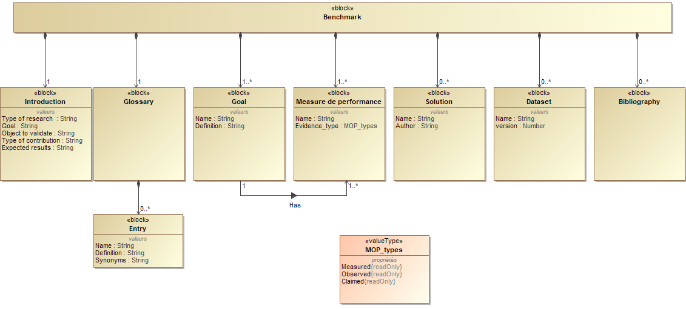

# Benchmark 1. "TemplateName"

This is a template that details the expected Minimum Viable Content of a benchmark. All minimum constitutive elements of a benchmark are formally defined in the meta-model below so as to share reproducible results.

## Introduction

*Guidelines:*

Write a short introduction of the benchmark that includes at least the following items:

- Type of research: does the benchmark intends to be qualitative and/or quantitative)
- The main discipline(s) it contributes to
- The goal of the study (to understand and/or improve design)
- The type of contribution (theory to knowledge and/or empirical to practice)
- Object(s) to validate (theory, method, tool, process...)
- Expected results

*Template:*

## Glossary

*Guidelines:*

To share a common understanding of ambiguous concepts, contributors shall agree upon the meaning of the key concepts by systematically providing a definition and potential synonyms. Participants should use existing terms and definitions from standards and not invent new ones, unless they have a very specific concept that requires the introduction of a new term and definition. Any new term and definition must be motivated and explained in the discussion of the repository (e.g. navigate to '*Repositories > Benchmark-0_Template > Discussions*', or [click here](https://github.com/GIS-S-mart/Benchmark-0_Template/discussions))

*Template:*

| **Concept** | **Synonyms** | **Definition** | **Source** |
| :---------: | :----------: | :------------: | :--------: |
|             |              |                |            |

## Goals

Specify the common set of goals that the competing solutions pursue:
- The solution shall enable to...
- The solution shall enable to...
- The solution shall enable to...

## Metrics

Metrics of usefulness are measures of performance which measure the degree the articulated goals have been achieved.

*Guidelines:*

1. Authors should use existing metrics and not invent new ones, unless they measure additional aspects not covered by existing ones.
2. Any change to existing metrics must be motivated and explained in the discussion of the repository (e.g. navigate to '*Repositories > Benchmark-0_Template > Discussions*', or [click here](https://github.com/GIS-S-mart/Benchmark-0_Template/discussions). Once the suggested change is informally approved by the community, the author shall post on the issues page of the benchmark (navigate to 'e.g. navigate to '*Repositories > Benchmark-0_Template > Issues', , or [click here](https://github.com/GIS-S-mart/Benchmark-0_Template/issues)) and briefly outline the new metric.

*Template:*

| **Name** | **Definition** | **Unit** |
| :------: | :------------: | :------: |
|          |                |          |

## Benchmark problems

Benchmark problems are test cases that serve to evaluate rival solutions.

*Guidelines:*

1. A benchmark problem is a representative example problem of the actual problem for which the solutions are intended.
2. Authors should use existing benchmark problems and not invent new ones, unless they have a very specific illustrative purpose not covered by existing ones.
3. The lack of showing particular benchmark problems in a manuscript says more than the benchmark problems included in a manuscript.
4. Any change to existing benchmark problems must be motivated and explained in the discussion of the repository (e.g. navigate to '*Repositories > Benchmark-0_Template > Discussions*', or [click here](https://github.com/GIS-S-mart/Benchmark-0_Template/discussions). Once the suggested change is informally approved by the community, the author shall post on the issues page of the benchmark (e.g. navigate to *Repositories > Benchmark-0_Template > Issues*, or [click here](https://github.com/GIS-S-mart/Benchmark-0_Template/issues)) and briefly outline the new benchmark problem.
5. A benchmark problem shall be stored on an open online repository (to be defined according to the type and size of the dataset, licensing, etc.) such as [Zenodo](https://zenodo.org/), [Recherche Data Gouv](https://entrepot.recherche.data.gouv.fr/dataverse/root), [Harvard Dataverse](https://dataverse.harvard.edu/), [4TU.ResearchData](https://data.4tu.nl/info/en/), [B2SHARE](https://eudat.eu/catalogue/B2SHARE), [B2DROP](https://eudat.eu/catalogue/B2DROP) with a preference for [Zenodo](https://zenodo.org/) which creates a persistent identifier (DOI) for the repository. This helps for [referencing and citing a  GitHub repository](https://docs.github.com/fr/repositories/archiving-a-github-repository/referencing-and-citing-content).

*Template:*

| **Name** | **Author(s)** | **Version** | **DOI** | **URL** | **License** |
| :------: | :-----------: | :---------: | :-----: | :-----: | :---------: |
|          |               |             |         |         |             |

## Solutions

A solution is a candidate theory, process, method, [...], or software that aims to solve a benchmark problem.

*Guidelines:*

1. It is imperative for good scientific practice that all results are reproducible.
2. It is strongly recommended to publish your research material (e.g. software code, model, simulation, coding book, etc.).

*Template:*

| **Name** | **Author(s)** | **Version** | **DOI** | **URL** | **License** |
| :------: | :-----------: | :---------: | :-----: | :-----: | :---------: |
|          |               |             |         |         |             |

## Experimental protocols

An experimental protocol is a logical and repeatable procedure to evaluate the metrics for a candidate solution to a benchmark problem. It ensures the successful replication of results by others.

*Guidelines:*

1. 
2. 

*Template:*

## Benchmarking

Benchmarking shall enable professional practitioners to determine which solution is better to employ in a specific context.

*Guidelines:*

1. When presenting a new solution, results must be quantitatively and not only qualitatively compared to the literature.
2. The comparison of solutions must be done in a fair and transparent manner.
3. Results should also be critically judged for physical sanity to avoid the ones that make little sense (e.g. optimized structure that makes little mechanical sense).

*Template:*

## Meta-Analysis

A meta-analysis is the statistical analysis of all results of the benchmark for the purpose of integrating the findings. Meta-analytic results are the most trustworthy source of evidence.

## References

*Guidelines:*

- Please use the Harvard format to list references supporting any data (definition, solution, metrics, benchmark problem, etc.) of the benchmark.
- Make sure to provide the DOI of the document.

*Template:*
